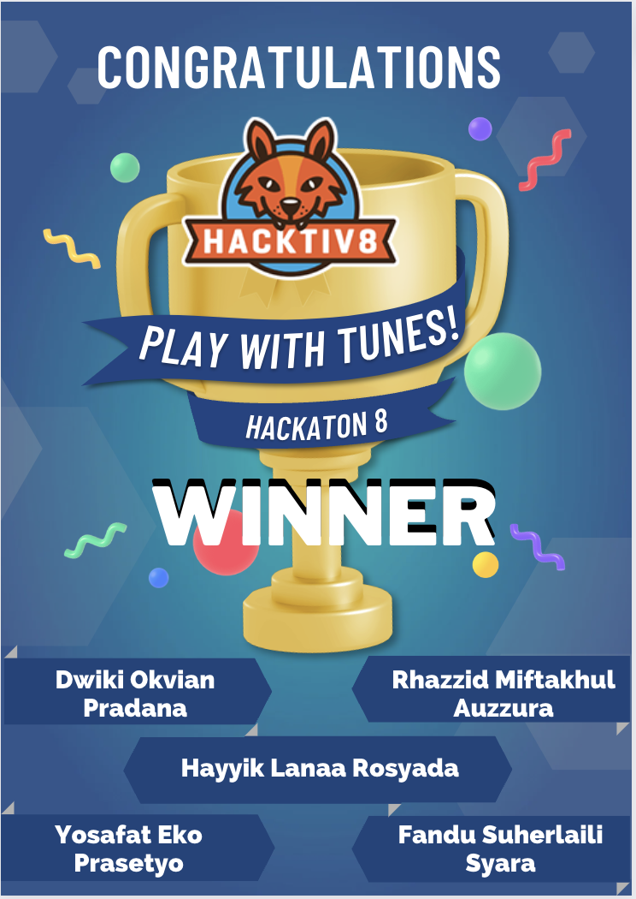

# PlayWithTunes!

## Overview
https://mashayyik.github.io/playwithtunes.github.io/

## Member
1. Hayyik Lanaa R as Fullstack
2. Dwiki Okvian P as DOM management
3. Rhazzid M. Auzzura as Backend
4. Yosafat Eko P as Product Presenter
5. Fandu Suharlaili as Feature Debugging

## Feature
- Record and Add the backtrack in to app (manipulation data, not save permanently)
- Edit Name of Composer, Name Of Song, Backtrack Pattern
- Playback and Set Tempo

## Specitifcation
Web Apps Building :
1. HTML5
2. CSS3 (TailwindCss Framework)
3. Javascript

## Award
We Win Phase-0 Hactiv8 final project competition
requirement : only used native JS (no framework JS allowed)

